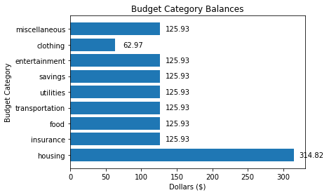
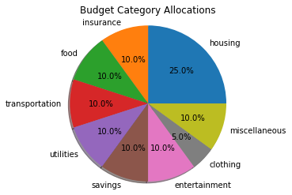
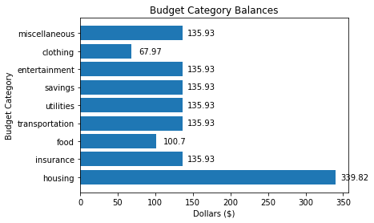

# BudgetTracker
The BudgetTracker allows you to keep track of your account balance and how much you spend on different budget categories. The budget categories are Housing, Food, Car, Clothing, Entertainment, and Other.

### Functionality
- Specificy the starting balance when you create a new BudgetTracker. The starting balance will then be allocated to the different budget categories.
- View the current balance of the account and the balances of each budget category.
- Keep track of withdrawals from the account and assign each withdrawal to a budget category.
- Keep track of deposits to the account and allocate the deposited amount across the budget categories.
- Log every withdrawal and deposit in the check register and save the check register to a csv file.

## Create an new BudgetTracker
In real life, every time I have set up a new budget, I have started with an account that already has money in it. The BudgetTracker allows you to set the starting balance when you create an account. Let's create a new account with an initial balance of $1,259.30. 


```python
from helpers import BudgetTracker
budget = BudgetTracker(starting_balance=1259.30, start_date='2020-01-05')
```

## View the current balance
When we start an account, the initial balance is allocated to the budget categories as follows: 30% goes into the Housing category, 20% into Food, 25% into Car, 10% into Clothing, 10% into Entertainment, and the remaining amount, roughly 5% goes into the Other category. Now that we have an account, we can view the balance.


```python
budget.show_balance()
```

    TOTAL BALANCE: $1,259.30
    -------------------------
    housing balance: $314.82
    insurance balance: $125.93
    food balance: $125.93
    transportation balance: $125.93
    utilities balance: $125.93
    savings balance: $125.93
    entertainment balance: $125.93
    clothing balance: $62.97
    miscellaneous balance: $125.93


```python
budget.show_balance_barchart()
```


    

    


## Budget Allocations
We can view a pie chart that shows how the balance is assigned to budget categories.


```python
budget.show_allocations_pie_chart()
```


    

    


## Start a check register
Create a check register that will keep track of all of your transacation. To start with, the register will only list the current balance. Everytime you add a new transaction to the check register, it's contents will be saved in a csv file called "check_register.csv." For those of you familiar with Pandas, the acct.check_register is a Pandas DataFrame. If you aren't familiar with Pandas, don't worry about this.


```python
budget.start_check_register()
budget.show_check_register()
```

    Check register:
       transaction_date  transaction_type budget_category  transaction_amount  \
    0       2020-01-05  starting balance            none                   0   
    
       current_balance  
    0           1259.3  


## Make a withdrawal
When you spend money, you can log the expense as a withdrawal from your account with acct.withraw(). You enter the date of the withdrawal, which budget category you wish to use, and the withdrawal amount. The withdrawal amount will be subtracted from the total balance and the balance of the specified budget category. The transaction will be logged in the check register.


```python
budget.withdraw(withdrawal_date = '2020-01-08', withdrawal_category='food', withdrawal_amount=35.23)
budget.show_balance_barchart()
```


    

    


```python
budget.show_check_register()
```

    Check register:
       transaction_date  transaction_type budget_category  transaction_amount  \
    0       2020-01-05  starting balance            none                0.00   
    0       2020-01-08        withdrawal            food               35.23   
    
       current_balance  
    0          1259.30  
    0          1224.07  


## Make a deposit
Make a deposit to the account with acct.deposit(). Enter the deposit date and amount. The deposit amount will be added to the total balance of the account and divided among the budget categories using acct.allocations.


```python
budget.deposit(deposit_date = '2020-01-09', deposit_amount=100.00)
budget.show_balance_barchart()
```


    

    


```python
budget.show_check_register()
```

    Check register:
       transaction_date  transaction_type budget_category  transaction_amount  \
    0       2020-01-05  starting balance            none                0.00   
    0       2020-01-08        withdrawal            food               35.23   
    0       2020-01-09           deposit             all              100.00   
    
       current_balance  
    0          1259.30  
    0          1224.07  
    0          1324.07  


## Future Functionality
- Incorporate testing.
- Start a BudgetTracker from a current check register.
- The current version requires that dates be in the ISO standard format: 'YYYY-MM-DD.' Add functionality to allow users to enter dates in other formats. E.g. '10-05-20', '10/05/20', 'Aug. 10, 20'.
- Allow users to change the default budget category allocation amounts.
- Create graphs of spending by budget category and month.
